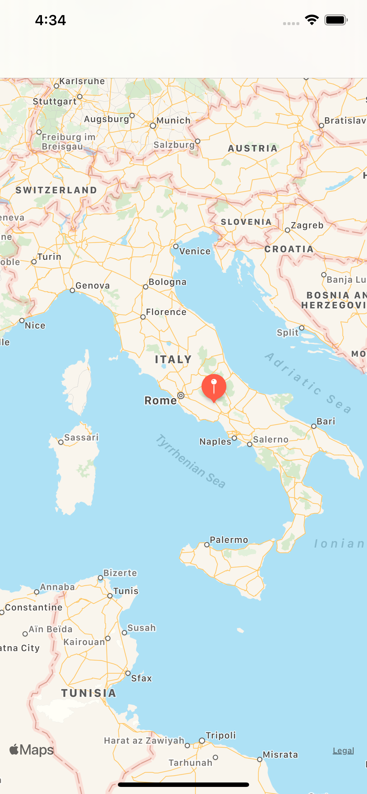
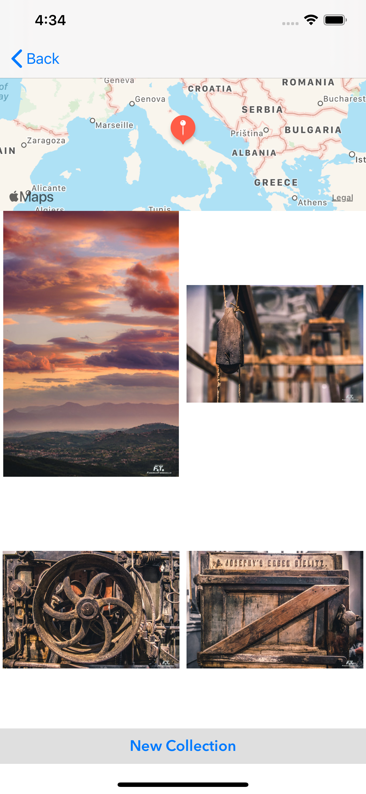
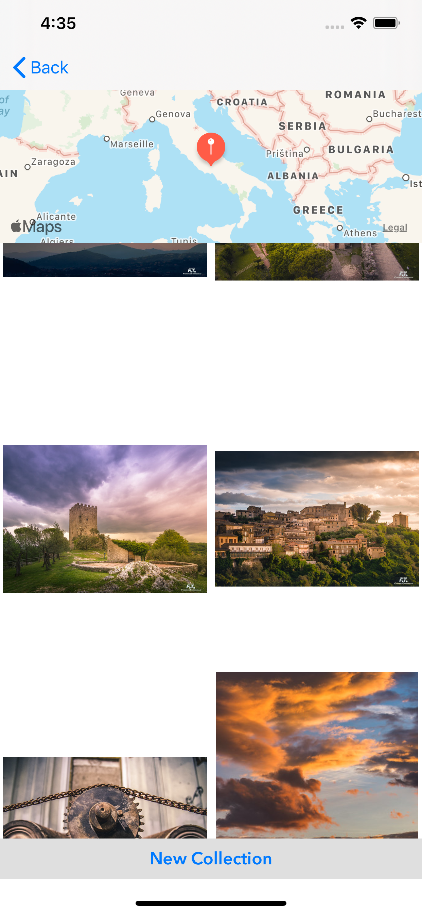

# Virtual Tourist
Virtual Tourist is an app that shows photos from Flickr based on specific coordinates depend on the user's tap on the map.
the user can drop a pin just by press long on the map. The pin coordinates are used to load images from Flickr.
The pin and the loaded images are saved on the phone and can be shown later without reloading them from Flickr.

<div style="text-align:center"></div>

<div style="text-align:center"></div>

<div style="text-align:center"></div>


### Clone repo
```
git clone https://github.com/FaisalBabkoor/VirtualTourist_Final.git
```
## Resources

| Framework | Description |
|--|--|
| [Kingfisher](https://github.com/onevcat/Kingfisher) | A lightweight, pure-Swift library for downloading and caching images from the web. |

